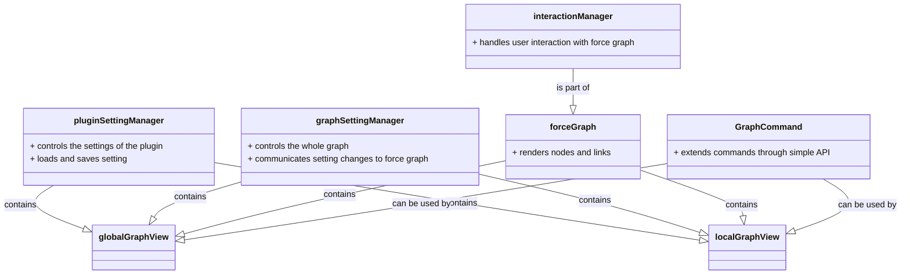

## Plugin architecture

The plugin consist of following component:

1. plugin setting manager
   1. it controls the settings of the plugin
   2. responsible for loading and saving setting
2. global graph view, a wrapper of graph setting manager and force graph
3. local graph view, a wrapper of graph setting manager and force graph
4. graph setting manager
   1. each graph view will have a graph setting manager
   2. it resposible for the control of the whole graph, then tell the force graph how to respond for setting changes
   3. the setting manager can be isolated from force graph because it follow separation of concern principle
5. force graph
   1. the graph itself render the the nodes and links
   2. interaction manager
      1. it is responsible to handle all the interaction of the user and the force graph
6. Graph Command
   1. has very simple API to extends commands

## Key guideline for plugin development

1. Each component here follow separation of concern principle. They can be isolated easily and still functions properly.
